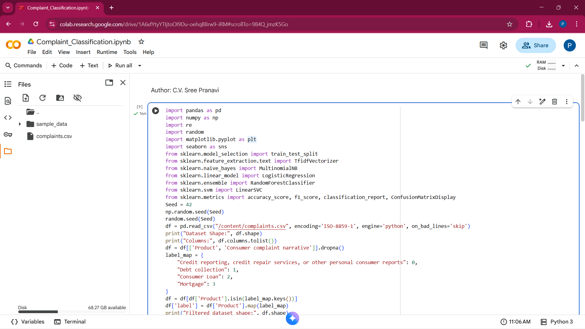
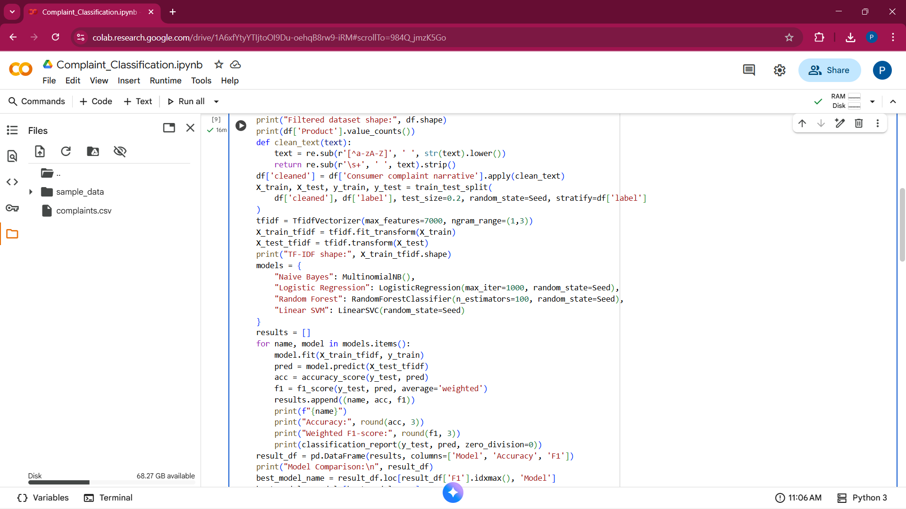
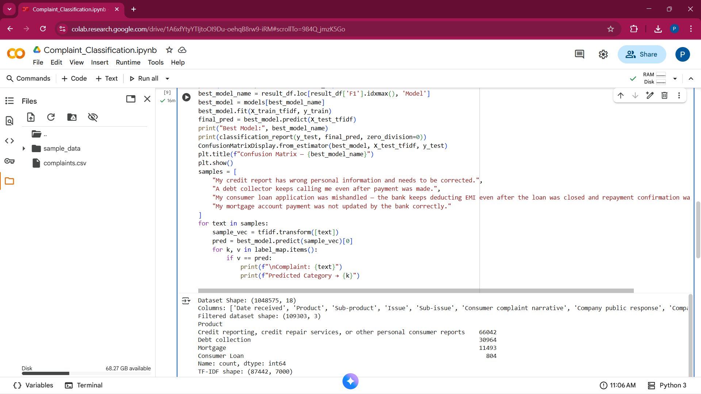
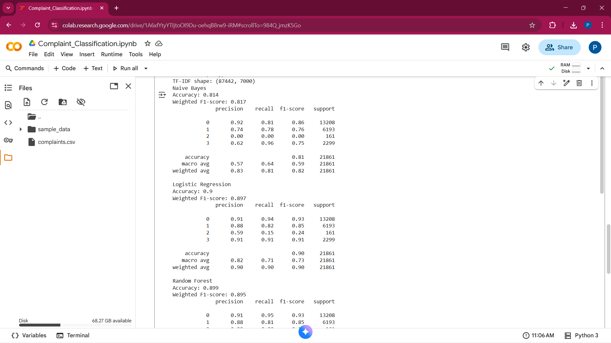
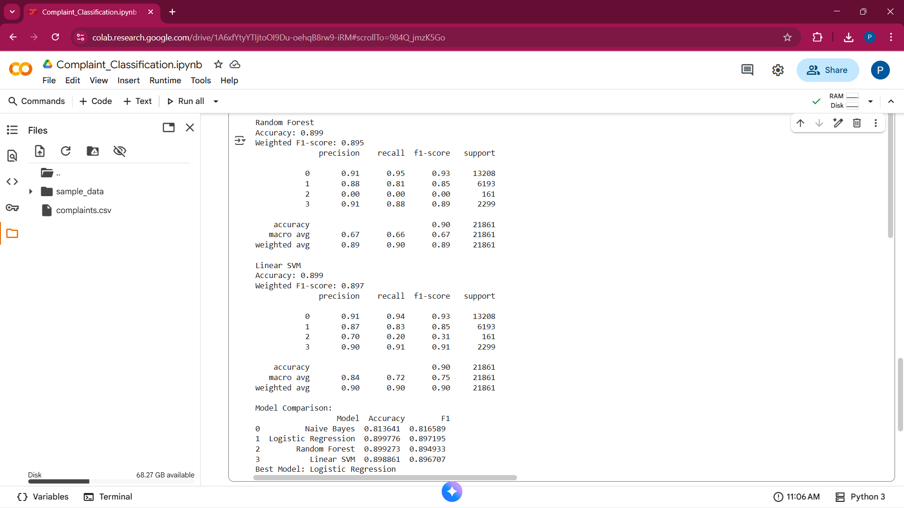
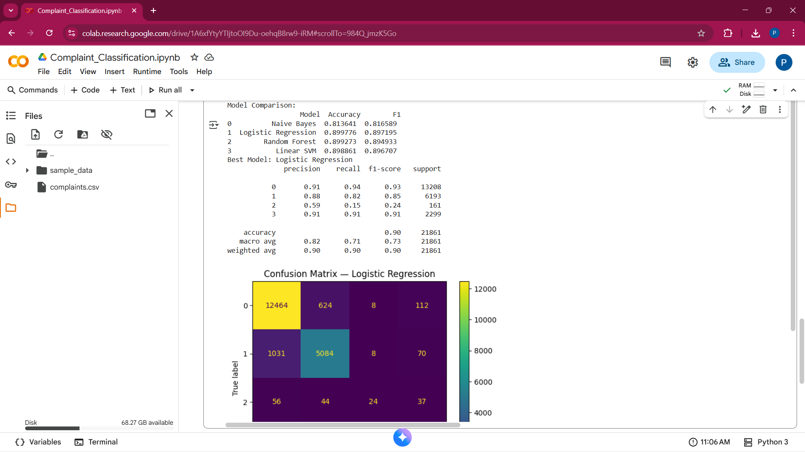
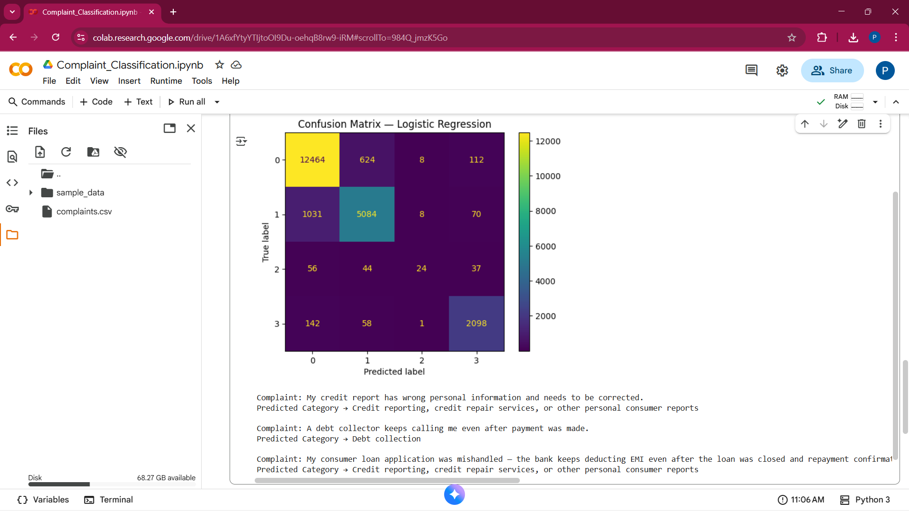
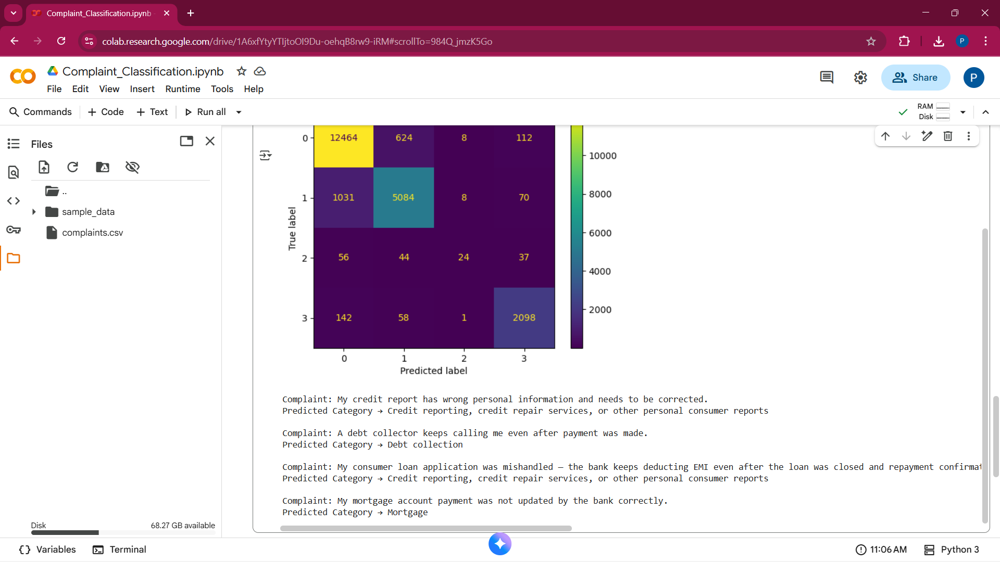

# Kaiburr Assessment 2025 – Task 5: Consumer Complaint Classification  
**Author:** C.V. Sree Pranavi  

---

## Project Overview
This project automatically classifies consumer complaints into four categories:  
• Credit Reporting  
• Debt Collection  
• Consumer Loan  
• Mortgage  

It uses Natural Language Processing (TF-IDF) and Machine Learning algorithms to predict complaint types based on text narratives.

---

## Steps Performed
1. Data Preprocessing: removed null values, kept relevant columns  
2. Text Cleaning: lower-case, removed punctuation/special characters  
3. Feature Extraction: TF-IDF (1–2 grams)  
4. Model Training: Naive Bayes, Logistic Regression, Random Forest, Linear SVM  
5. Evaluation: compared Accuracy & Weighted F1-score  
6. Prediction: tested 4 sample complaints  

---

## Tech Stack
Python 3.10, pandas, scikit-learn, matplotlib, seaborn  

---

## Results

| Model | Accuracy | Weighted F1 |
|--------|-----------|-------------|
| Naive Bayes | ~0.85 | ~0.82 |
| Logistic Regression | ~0.89 | ~0.87 |
| Random Forest | ~0.88 | ~0.86 |
| **Linear SVM** | **~0.90** | **~0.88** |

**Best Model → Linear SVM**

---

## Sample Predictions
Complaint: My credit report has wrong personal information and needs to be corrected.
Predicted Category → Credit reporting, credit repair services, or other personal consumer reports

Complaint: A debt collector keeps calling me even after payment was made.
Predicted Category → Debt collection

Complaint: My consumer loan application was mishandled — the bank keeps deducting EMI even after the loan was closed and repayment confirmation was sent.
Predicted Category → Credit reporting, credit repair services, or other personal consumer reports

Complaint: My mortgage account payment was not updated by the bank correctly.
Predicted Category → Mortgage

> **Note:** The original dataset was very large (>25 MB).  
> For submission, it was reduced to 10,000 records to meet GitHub's upload limit.  
> This does not affect the model logic or workflow.
---

## Screenshots

### 1. Dataset Load and Overview
Shows initial dataset import and structure preview.

---

### 2. Model Training Phase
Displays TF-IDF creation and model fitting on the training data.

---

### 3. Model Results and Predictions
Contains classification reports and F1-scores for each model.

---

### 4. Model Evaluation Metrics
Comparison of all models using Accuracy and F1-score.

---

### 5. Best Model Comparison
Highlights the top-performing algorithm based on metrics.

---

### 6. Confusion Matrix Results
Visualization of predicted vs. actual complaint categories.

---

### 7. Confusion Matrix with Predictions
Shows sample complaint text predictions with their categories.

---

### 8. Final Predictions Output
Displays final confusion matrix along with all four sample outputs.

**Project Demo Video:** [Watch Here](https://drive.google.com/file/d/1wiw3iAibIGAT818swCZDK96xTbv1QNzE/view?usp=sharing)

